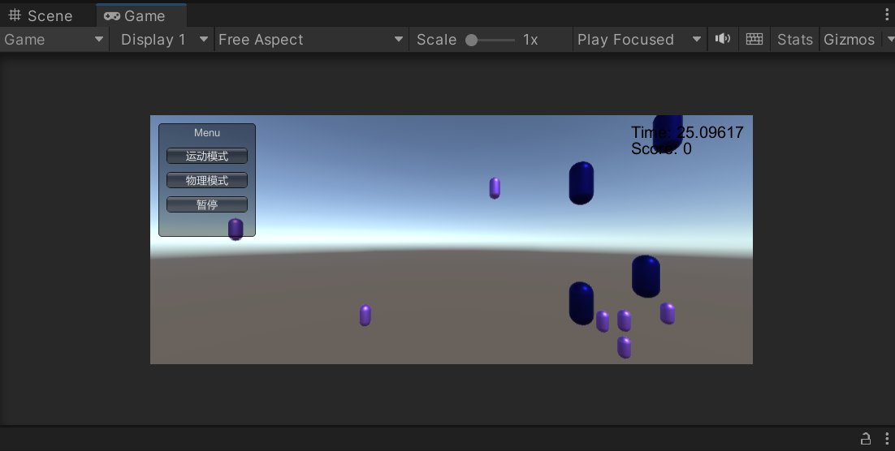
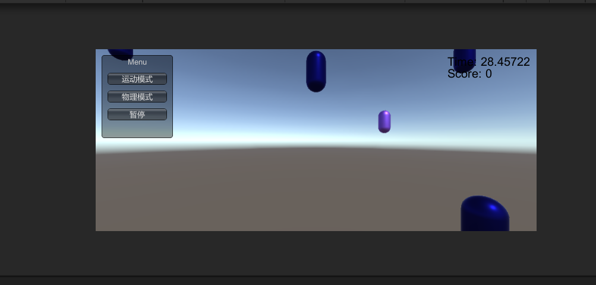

# 鼠标打飞碟游戏（Hit UFO)改良版
## 要求
### 按 adapter模式设计图修改飞碟游戏
### 使它同时支持物理运动与运动学（变换）运动
## 介绍
本次作业在上次的基础上进行了修改，仍然是让两种大小的飞碟从上往下落，不过本次通过adapter模式同时支持物理运动（为降低难度，也会向前移动，是抛物线）和运动学运动两种。并且为了实现Adapter模式，本次修改后，使用了运动管理模式。

也因此，部分功能删除了。本次只有一回合，且开始游戏后无法重新开始。但暂停功能保留了下来，两种模式均可暂停。
## 代码
对于代码，这里只放了新增加的。
### 动作基类
此基类为之前使用的模板，不多介绍。

```
public enum SSActionEventType : int { Started, Competeted }

public interface ISSActionCallback
{
    void SSActionEvent(SSAction source, 
    SSActionEventType events = SSActionEventType.Competeted,
    int intParam = 0, string strParam = null, Object objectParam = null);
}

public class SSAction : ScriptableObject
{
    public bool enable = true;
    public bool destory = false;
    public GameObject gameobject{get;set;}
    public Transform transform{get;set;}
    public ISSActionCallback callback{get;set;}
    // Start is called before the first frame update
    protected SSAction(){}
    public virtual void Start()
    {
        throw new System.NotImplementedException();
    }

    // Update is called once per frame
    public virtual void Update()
    {
        throw new System.NotImplementedException();
    }
    public virtual void FixedUpdate()
    {
        throw new System.NotImplementedException();
    }
}
```
### 动作管理基类
此基类为之前使用的模板，仅在FixedUpdate()中重复了一遍Update(),因为物理模式更适合使用ixedUpdate()。
```
public class ActionManager : MonoBehaviour,ISSActionCallback
{
    // Start is called before the first frame update
    private Dictionary<int,SSAction> actions = new Dictionary<int,SSAction>();
    private List<SSAction> waitingAdd = new List<SSAction>();
    private List<int> waitingDelete = new List<int>();

    protected void Update()
    {
        foreach(SSAction ac in waitingAdd) actions[ac.GetInstanceID()] = ac;
        waitingAdd.Clear();
        foreach(KeyValuePair<int,SSAction> kv in actions){
            SSAction ac = kv.Value;
            if(ac.destory){
                waitingDelete.Add(ac.GetInstanceID());
            }
            else if(ac.enable){
                ac.Update();
            }
        }
        foreach(int key in waitingDelete){
            SSAction ac = actions[key];
            actions.Remove(key);
            DestroyObject(ac);
        }
        waitingDelete.Clear();
    }
    protected void FixedUpdate(){
        foreach (SSAction ac in waitingAdd)
        {
            actions[ac.GetInstanceID()] = ac;
        }
        waitingAdd.Clear();

        foreach (KeyValuePair<int, SSAction> kv in actions)
        {
            SSAction ac = kv.Value;
            if (ac.destory)
            {
                waitingDelete.Add(ac.GetInstanceID());
            }
            else if (ac.enable)
            {
                ac.FixedUpdate();
            }
        }

        foreach (int key in waitingDelete)
        {
            SSAction ac = actions[key];
            actions.Remove(key);
            DestroyObject(ac);
        }
        waitingDelete.Clear();
    }

    public void RunAction(GameObject gameObject,SSAction action,ISSActionCallback icb){
        action.gameobject = gameObject;
        action.transform = gameObject.transform;
        action.callback = icb;
        waitingAdd.Add(action);
        action.Start();
    }

    protected void Start()
    {  
    }
    public void SSActionEvent(SSAction source, 
    SSActionEventType events = SSActionEventType.Competeted,
    int intParam = 0, string strParam = null, Object objectParam = null){
    }
}
```

### 运动学动作类
实现了运动学模式，飞碟从天上往下掉的动作，在前一次时，是在DickAction()中实现的。修改后，DickAction()仅为飞碟提供一些参数。本部分，Update()会判断当前游戏的状态，如果是暂停的，则不会运动。而当物体离开界面时，则会对其进行销毁。Start()会调整Rigidbody的isKinematic使其无效。
```
public class MoveToAction : SSAction
{
    public int speed;
    static DiskFactory fc;
    private MoveToAction(){}
    public static MoveToAction GetSSAction(int speed){
        MoveToAction action = ScriptableObject.CreateInstance<MoveToAction>();
        action.speed = speed;
        return action;
    }
    // Start is called before the first frame update
    public override void Start()
    {
        fc = Singleton<DiskFactory>.Instance;
        this.transform.gameObject.GetComponent<Rigidbody>().isKinematic=true;
    }

    // Update is called once per frame
    public override void Update()
    {
        //this.transform.position = Vector3.MoveTowards(this.transform.position,target,speed*Time.deltaTime);
        if(fc.statue==1)transform.Translate(new Vector3(0,-1,0)*speed*Time.deltaTime);
        if(this.transform.position.y<-7){
            fc.FreeDisk(this.transform.gameObject);
            this.destory = true;
            this.callback.SSActionEvent(this);
        }
    }
    public override void FixedUpdate(){

    }
}    
```

### 运动学动作管理类
调用函数，实现飞碟的掉落。
```
public class MoveActionController : ActionManager
{
    public SSAction MovetoGround;
    static DiskFactory fc;
    protected new void Start()
    {
        fc = Singleton<DiskFactory>.Instance;
    }
    public void Movetoground(GameObject b){
        MovetoGround = MoveToAction.GetSSAction(b.GetComponent<DickAction>().speed);
        this.RunAction(b,MovetoGround,this);
    }
    protected new void Update()
    {
        base.Update();
    }
    protected new void FixedUpdate()
    {
        base.FixedUpdate();
    }
}
```
### 物理动作类
本部分，为实现物理学的飞碟运动。Rigidbody为物体施加了重量，自己就会自由落体，但是，太快了，为了降低难度，让其做抛物线运动，向着镜头的方向。在FixedUpdate()会判断是否暂停，和是否应该销毁。
```
public class PhysicalAction : SSAction
{
    // Start is called before the first frame update
    public float speed;
    Vector3 rec;
    static DiskFactory fc;
    public static PhysicalAction GetSSAction(float speed){
        PhysicalAction action = ScriptableObject.CreateInstance<PhysicalAction>();
        action.speed = speed;
        return action;
    }
    public override void Start()
    {
        fc = Singleton<DiskFactory>.Instance;
        gameobject.GetComponent<Rigidbody>().velocity =  new Vector3(0,0,-speed);
    }
    public override void FixedUpdate()
    {
        if(fc.statue==0||fc.statue==2){
            Rigidbody rigidbody = transform.GetComponent<Rigidbody>();
            rec=rigidbody.velocity;
            rigidbody.velocity = Vector3.zero;
            rigidbody.constraints = RigidbodyConstraints.FreezeAll;
        }
        else if(fc.statue==1&&gameobject.GetComponent<Rigidbody>().velocity==Vector3.zero){
            Rigidbody rigidbody = transform.GetComponent<Rigidbody>();
            rigidbody.velocity = rec;
            rigidbody.constraints = RigidbodyConstraints.None;
        }
        if(this.transform.position.y<-7){
            fc.FreeDisk(this.transform.gameObject);
            this.destory = true;
            this.callback.SSActionEvent(this);
        }
    }
}
```

### 物理动作管理类
实现对物理动作的管理，仅一个动作，不多解释。
```
public class PhysicalController : ActionManager
{
     
    SSAction PhysicalMove;
    public void Start()
    {   
    }
    public void Physicalmove(GameObject b){
        PhysicalMove = PhysicalAction.GetSSAction(b.GetComponent<DickAction>().speed);
        this.RunAction(b,PhysicalMove,this);
    }
    public void Update()
    {
    }
}
```
### Adapter类
实现一个选择,当i为1时为运动学模式，当为2时是物理模式。
```
public interface IActionAdapter{
    void HitDisk(GameObject obj ,int i);
}

public class MyAdapter : MonoBehaviour,IActionAdapter
{
    //MyController mcl;
    MoveActionController mac;
    PhysicalController phc;
    // Start is called before the first frame update
    void Start()
    {
        //mcl = SDirector.getInstance().currentScenceController as MyController;
        //mcl.ma=this;
        mac = gameObject.AddComponent<MoveActionController>() as MoveActionController;
        phc = gameObject.AddComponent<PhysicalController>() as PhysicalController;
    }
    // Update is called once per frame
    void Update()
    {   
    }
    public void HitDisk(GameObject obj ,int i){
        if(i==1){
            mac.Movetoground(obj);
        }
        else{
            phc.Physicalmove(obj);
        }
    }
}
```

### 修改部分
为了实现该效果，删除了round部分，去掉了UserGUI的start按钮，增加为运动模式和物理模式。
DiskFactory的FreeDisk修改如下：
```
public void FreeDisk(GameObject b){
        b.SetActive(true);
        b.transform.position = new Vector3(Random.Range(-12,12),7,0);
        b.GetComponent<Rigidbody>().velocity=Vector3.zero;
        b.GetComponent<DickAction>().score /= b.GetComponent<DickAction>().speed;
        b.GetComponent<DickAction>().speed = (int)Random.Range(1,6);
        b.GetComponent<DickAction>().score *= b.GetComponent<DickAction>().speed;
        used.Remove(b);
        free.Add(b);
    }
```
为了实现物理模式，每次GameObject回收时会重置速度。
MyController添加了“public IActionAdapter ma;”，对于每次创建新的飞碟时调用Adapter模式中写好的函数，使其能够根据选择的模式运动。
```
public void PushDisk(){
        GameObject disk=fcc.getDisk();
        ma.HitDisk(disk,mode);
    }
    void Update()
    {
        if(Gamestatue==1) HitDel();
        diskNum+=Time.deltaTime;
        if(diskNum>=0.4&&Gamestatue==1){
            PushDisk();
            diskNum=0;
        }
        
    }
```

## 效果
效果图如下：

运动模式：

物理模式：

运动模式与上次效果基本一致，不再额外展示。
视频：https://live.csdn.net/v/257310?spm=1001.2014.3001.5501